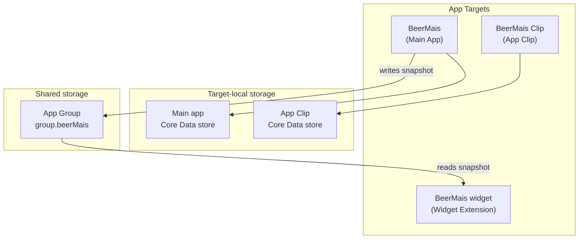
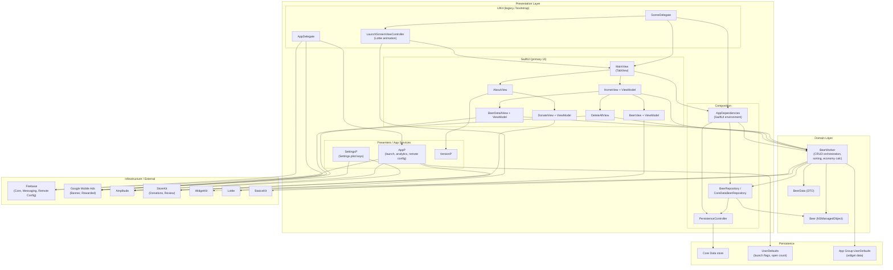
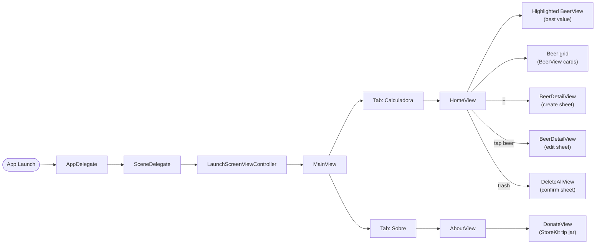
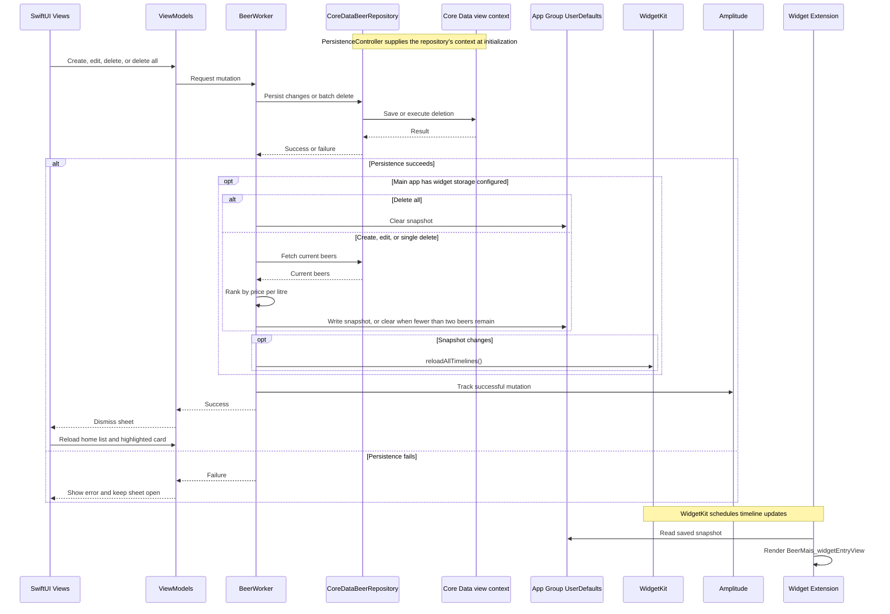

# beerMais-ios

Beer Mais — compare beer prices by cost per ml and find the best value.

[App Store](https://apps.apple.com/br/app/beer-mais/id1450659497)

## High-level targets

The project has a main app, a widget extension, and an App Clip. The main app writes widget data to an App Group; the App Clip uses its own database and does not update the widget:

## Layer architecture (main app)

The app uses a **hybrid UIKit + SwiftUI** setup with a **Domain layer** for beer logic and persistence.

## Navigation & screen flow

The main app presents `MainView` after the launch animation. The App Clip opens `MainView` directly.

## Data flow (beer CRUD → widget)

Successful mutations update widget data before analytics events are recorded. The main app also refreshes the snapshot when its scene becomes active. WidgetKit controls when requested timeline updates appear.

## Folder structure

| Layer | Path | Responsibility |
|---|---|---|
| **Config** | `BeerMais/Config/` | `AppDelegate`, `SceneDelegate`, assets, entitlements, Core Data model |
| **Views** | `BeerMais/Views/` | SwiftUI screens (`MainView`, `HomeView`, `BeerDetailView`, etc.) |
| **Scenes** | `BeerMais/Scenes/` | UIKit launch screen |
| **Domain** | `BeerMais/Domain/` | `Beer`, `BeerWorker`, `PersistenceController`, `BeerRepository`, `AppDependencies` |
| **Presenters** | `BeerMais/Presenters/` | App-wide services (`AppP`, `SettingsP`, `VersionP`) |
| **Common** | `BeerMais/Common/` | Reusable UI, ads, extensions |
| **Libraries** | `BeerMais/Libraries/` | Firebase Remote Config abstractions |
| **Strings** | `BeerMais/Strings/` | Localization (en, pt-BR, es) |
| **Widget** | `BeerMais widget/` | Home screen widget |
| **Clip** | `BeerMais Clip/` | Lightweight App Clip entry → `MainView` |

## Dependencies (SPM and system frameworks)

| Package | Used for |
|---|---|
| **firebase-ios-sdk** | Firebase Core, Messaging, Remote Config |
| **swift-package-manager-google-mobile-ads** | Banner & rewarded ads |
| **Amplitude-Swift** | Analytics & error tracking |
| **lottie-spm** | Launch animation |
| **BasicsKit** | Shared utilities (string/number parsing) |
| **StoreKit** (Apple system framework) | In-app tips (donations) & review prompts |

## Architecture notes

1. **Primary pattern**: `SceneDelegate` builds `AppDependencies` and injects it into `MainView` through SwiftUI environment; feature ViewModels receive the configured `BeerWorker` explicitly.
2. **Persistence boundary**: `PersistenceController` owns each target's Core Data container. `CoreDataBeerRepository` performs CRUD and batch-delete work; `BeerWorker` retains comparison rules and coordinates analytics/widget updates.
3. **Legacy UIKit**: `LaunchScreenViewController` bootstraps the main app before presenting `MainView` (SwiftUI).
4. **Cross-target sharing**: Widget data flows through **App Group** `UserDefaults`, not Core Data directly in the widget.
5. **App Clip**: Reuses `MainView` with its own dependency container and target-local Core Data store; it does not share the main app's Core Data database or write widget snapshots.
