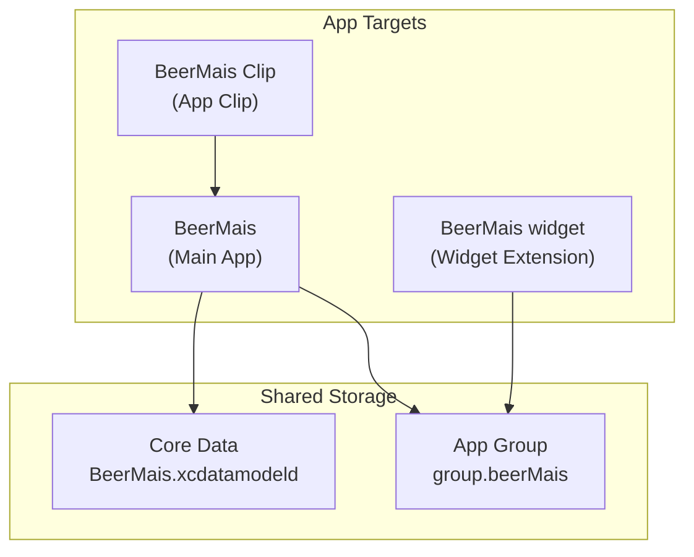
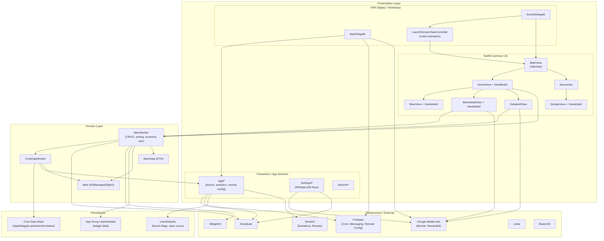
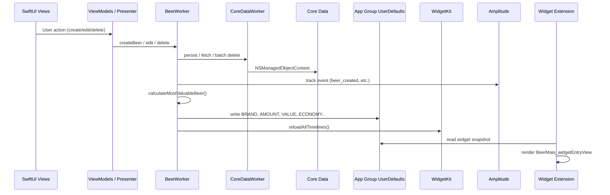

# beerMais-ios

Beer Mais — compare beer prices by cost per ml and find the best value.

[App Store](https://apps.apple.com/br/app/beer-mais/id1450659497)

## High-level targets

The project has three app targets plus shared data via an App Group:



## Layer architecture (main app)

The app uses a **hybrid UIKit + SwiftUI** setup with a **Domain layer** for beer logic and persistence.



## Navigation & screen flow

```mermaid
flowchart LR
    Start([App Launch]) --> AD[AppDelegate]
    AD --> SD[SceneDelegate]
    SD --> Launch[LaunchScreenViewController]
    Launch --> Main[MainView]

    Main --> TabHome[Tab: Calculadora]
    Main --> TabAbout[Tab: Sobre]

    TabHome --> Home[HomeView]
    Home --> Highlight[Highlighted BeerView<br/>(best value)]
    Home --> Grid[Beer grid<br/>(BeerView cards)]
    Home -->|"+"| Create[BeerDetailView<br/>(create sheet)]
    Home -->|tap beer| Edit[BeerDetailView<br/>(edit sheet)]
    Home -->|trash| Delete[DeleteAllView<br/>(confirm sheet)]

    TabAbout --> About[AboutView]
    About --> Donate[DonateView<br/>(StoreKit tip jar)]
```

## Data flow (beer CRUD → widget)



## Folder structure

| Layer | Path | Responsibility |
|---|---|---|
| **Config** | `BeerMais/Config/` | `AppDelegate`, `SceneDelegate`, assets, entitlements, Core Data model |
| **Views** | `BeerMais/Views/` | SwiftUI screens (`MainView`, `HomeView`, `BeerDetailView`, etc.) |
| **Scenes** | `BeerMais/Scenes/` | UIKit launch screen |
| **Domain** | `BeerMais/Domain/` | `Beer`, `BeerWorker`, `CoreDataWorker` |
| **Presenters** | `BeerMais/Presenters/` | App-wide services (`AppP`, `SettingsP`, `VersionP`) |
| **Common** | `BeerMais/Common/` | Reusable UI, ads, extensions |
| **Libraries** | `BeerMais/Libraries/` | Firebase Remote Config abstractions |
| **Strings** | `BeerMais/Strings/` | Localization (en, pt-BR, es) |
| **Widget** | `BeerMais widget/` | Home screen widget |
| **Clip** | `BeerMais Clip/` | Lightweight App Clip entry → `MainView` |

## External dependencies (SPM)

| Package | Used for |
|---|---|
| **firebase-ios-sdk** | Firebase Core, Messaging, Remote Config |
| **swift-package-manager-google-mobile-ads** | Banner & rewarded ads |
| **Amplitude-Swift** | Analytics & error tracking |
| **lottie-spm** | Launch animation |
| **BasicsKit** | Shared utilities (string/number parsing) |
| **StoreKit** | In-app tips (donations) & review prompts |

## Architecture notes

1. **Primary pattern**: SwiftUI views + `ObservableObject` ViewModels calling `BeerWorker` directly.
2. **Legacy UIKit**: `LaunchScreenViewController` bootstraps the app before presenting `MainView` (SwiftUI).
3. **Single domain service**: `BeerWorker` owns business rules (price per ml, sorting, economy), persistence orchestration, analytics, and widget sync.
4. **Cross-target sharing**: Widget data flows through **App Group** `UserDefaults`, not Core Data directly in the widget.
5. **App Clip**: Reuses `MainView` without the launch animation wrapper.
